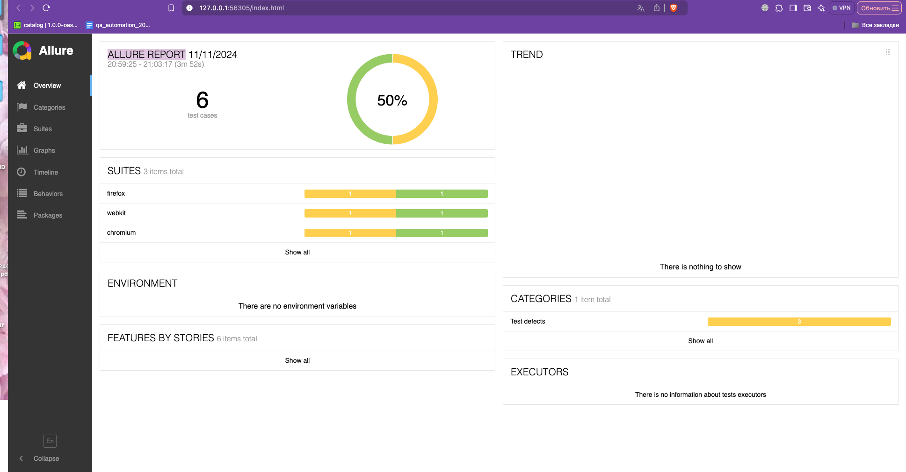

# 🎭 Playwright JS + Playwright 🎭

## 📃 About this project

#### The project provides tests for the Graduation project:

- 5 api tests
- 5 UI (functional tests)
- Allure-reports
- CI-CD
- Readme
- Reporting

  - Allure is enabled with history saved in Github

  - Added screenshots of allure and allure testops
  - The launch results are transmitted to allure testops

## Run the tests:

- In the Console: npx playwright test
- In the Chromium: npx playwright test --ui
- In the Allure-reporting :
  - npm run allure
  - allure serve allure-results
